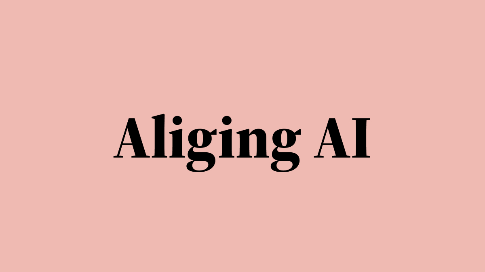
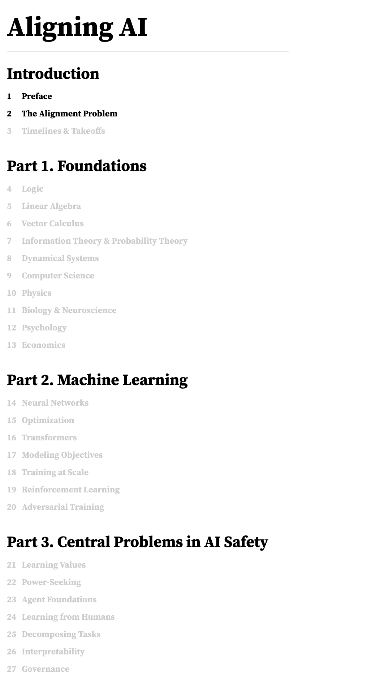

<br />
<div align="center">
  <a href="https://github.com/jqhoogland/aligning-ai">
    
  </a>

  <p align="center">
    AI safety needs a textbook. This is it.
    <br />
    <a href="https://agi-curriculum.vercel.app"><strong>Read the textbook »</strong></a>
    <br />
    <br />
    <a href="https://github.com/jqhoogland/aligning-ai/tree/main/CONTRIBUTING">Contribute Content</a>
    ·
    <a href="https://github.com/jqhoogland/aligning-ai/issues">Report Bug</a>
    ·
    <a href="https://github.com/jqhoogland/aligning-ai/issues">Request Feature</a>
  </p>
</div>


<!-- PROJECT SHIELDS -->
[![Contributors][contributors-shield]][contributors-url]&nbsp;&nbsp;&nbsp;
[![Forks][forks-shield]][forks-url]&nbsp;&nbsp;&nbsp;
[![Stargazers][stars-shield]][stars-url]&nbsp;&nbsp;&nbsp;
[![Issues][issues-shield]][issues-url]


<!-- ABOUT THE PROJECT -->
<div align="center">
    
</div>

<!-- CONTRIBUTING -->
## Contributing

Contributions are what make the open source community such an amazing place to learn, inspire, and create. Any contributions you make are **greatly appreciated**.

If you have a suggestion that would make this better, please fork the repo and create a pull request. You can also simply open an issue with the tag "enhancement".
Don't forget to give the project a star! Thanks again!

1. Fork the Project
2. Create your Feature Branch (`git checkout -b feature/AmazingFeature`)
3. Commit your Changes (`git commit -m 'Add some AmazingFeature'`)
4. Push to the Branch (`git push origin feature/AmazingFeature`)
5. Open a Pull Request


<!-- GETTING STARTED -->
## Getting Started

This is an example of how you may give instructions on setting up your project locally.
To get a local copy up and running follow these simple example steps.

[][Astro.js]
### Prerequisites

This is an example of how to list things you need to use the software and how to install them.
* npm
  ```sh
  npm install npm@latest -g
  ```

### Installation

1. Get a free API Key at [https://example.com](https://example.com)
2. Clone the repo
   ```sh
   git clone https://github.com/jqhoogland/aligning-ai.git
   ```
3. Install NPM packages
   ```sh
   npm install
   ```
4. Enter your API in `config.js`
   ```js
   const API_KEY = 'ENTER YOUR API';
   ```

# Reference

## Latex

In addition to the default [Katex symbols](https://katex.org/docs/support_table.html), we've provided a number of useful latex macros:

E.g.
- `\B{x}` for `\boldsymbol{x}` and `\b{x}` for `\mathbf{x}`
-  `\N`, `\QQ`, `\RR`, `\CC` for $\mathbb{N}$, $\mathbb{Q}$, $\mathbb{R}$, $\mathbb{C}$.
- `\t{3.1}{f(x) = x^2-1}` is equivalent to `\htmlId{eq:3.1}{f(x) = x^2-1 \tag{3.1}}`


## Misc

- Wrap equations in `$\htmlId{eq:my-eq-name}{f(x) = x^2-1}$`
- When you select an equation and copy it, you'll copy the latex source.
- Equation numbering is manual with `\tag{3.1}`. 


<!-- LICENSE -->
## License

The code supporting the website is distributed under an MIT License. See `LICENSE.txt` for more information.
The figures and interactive elements are distributed under a CC-BY-SA 4.0 License. See `LICENSE-figures.txt` for more information.

See individual chapters for notes on how to cite the content. 


<!-- CONTACT -->
## Contact

Jesse Hoogland - [@hoogland_jesse](https://twitter.com/hoogland_jesse) - jesse@jessehoogland.com

Project Link: [https://github.com/jqhoogland/aligning-ai](https://github.com/jqhoogland/aligning-ai)


<!-- ACKNOWLEDGMENTS -->
<!-- ## Acknowledgments

* []()
* []()
* []() -->


<!-- MARKDOWN LINKS & IMAGES -->
<!-- https://www.markdownguide.org/basic-syntax/#reference-style-links --> 
[site-url]: https://agi-curriculum.vercel.app/
[contributors-shield]: https://img.shields.io/github/contributors/jqhoogland/aligning-ai.svg?style=for-the-badge
[contributors-url]: https://github.com/jqhoogland/aligning-ai/graphs/contributors
[forks-shield]: https://img.shields.io/github/forks/jqhoogland/aligning-ai.svg?style=for-the-badge
[forks-url]: https://github.com/jqhoogland/aligning-ai/network/members
[stars-shield]: https://img.shields.io/github/stars/jqhoogland/aligning-ai.svg?style=for-the-badge
[stars-url]: https://github.com/jqhoogland/aligning-ai/stargazers
[issues-shield]: https://img.shields.io/github/issues/jqhoogland/aligning-ai.svg?style=for-the-badge
[issues-url]: https://github.com/jqhoogland/aligning-ai/issues
[license-shield]: https://img.shields.io/github/license/jqhoogland/aligning-ai.svg?style=for-the-badge
[license-url]: https://github.com/jqhoogland/aligning-ai/blob/master/LICENSE.txt
[linkedin-shield]: https://img.shields.io/badge/-LinkedIn-black.svg?style=for-the-badge&logo=linkedin&colorB=555
[linkedin-url]: https://linkedin.com/in/linkedin_username
[product-screenshot]: public/screenshot.png
[Astro.js]: https://astro.build
[Astro-url]: https://astro.build/assets/press/full-logo-dark.svg
[React.js]: https://img.shields.io/badge/React-20232A?style=for-the-badge&logo=react&logoColor=61DAFB
[React-url]: https://reactjs.org/
